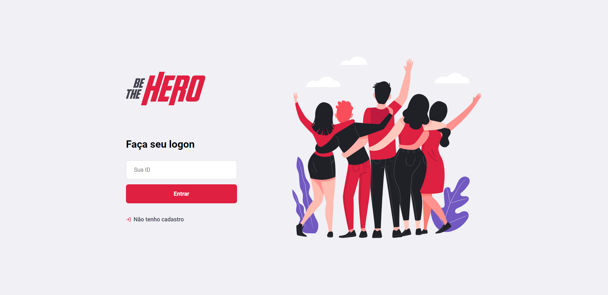

<h1 align="center">BeTheHero 🦸‍♀️🚀</h1>

 Desenvolvido durante a Semana Omnistack 11 o BeTheHero é um projeto que visa conectar pessoas que querem contribuir financeiramente com ONGs 🚀 

 

 

<h2 align="center">Teste o projeto 💻</h2>

-Execute o comando git clone https://github.com/jean-paulo/semana-omnistack11.git na pasta que deseja baixar o projeto.

-Instale as depêndencias do projeto com o comando npm install ou npm i no terminal, na pasta do projeto.

